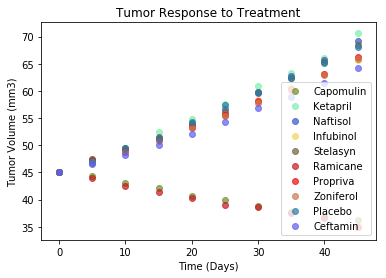
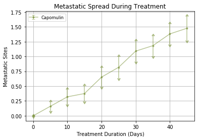
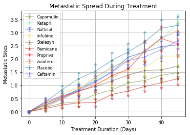
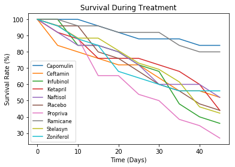
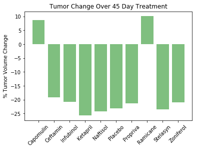

## Pymaceuticals Inc.
### Analysis
#### OBSERVED TREND 1
Ramicane and Capomulin were more favorable to decrease the rate of growth
#### OBSERVED TREND 2
Propriva and Infubinol were less favorable to decrease the rate of growth
#### OBSERVED TREND 3
The rate of change of tumor size was quite consistent with the expection of Propriva and Infubinol


```
import pandas as pd
import matplotlib.pyplot as plt
import numpy as np
from scipy import stats
from pprint import pprint

# create random colors
from random import randint

```


```
ct_file = "raw_data/clinicaltrial_data.csv"
m_file = "raw_data/mouse_drug_data.csv"
```


```
ct_df = pd.read_csv(ct_file)
#ct_df.head()
```


```
m_df = pd.read_csv(m_file)
#m_df.head()
```


```
df= pd.merge(ct_df,m_df, on="Mouse ID", how="outer")
df.head()
```


<div>
<style scoped>
    .dataframe tbody tr th:only-of-type {
        vertical-align: middle;
    }

    .dataframe tbody tr th {
        vertical-align: top;
    }

    .dataframe thead th {
        text-align: right;
    }
</style>
<table border="1" class="dataframe">
  <thead>
    <tr style="text-align: right;">
      <th></th>
      <th>Mouse ID</th>
      <th>Timepoint</th>
      <th>Tumor Volume (mm3)</th>
      <th>Metastatic Sites</th>
      <th>Drug</th>
    </tr>
  </thead>
  <tbody>
    <tr>
      <th>0</th>
      <td>b128</td>
      <td>0</td>
      <td>45.000000</td>
      <td>0</td>
      <td>Capomulin</td>
    </tr>
    <tr>
      <th>1</th>
      <td>b128</td>
      <td>5</td>
      <td>45.651331</td>
      <td>0</td>
      <td>Capomulin</td>
    </tr>
    <tr>
      <th>2</th>
      <td>b128</td>
      <td>10</td>
      <td>43.270852</td>
      <td>0</td>
      <td>Capomulin</td>
    </tr>
    <tr>
      <th>3</th>
      <td>b128</td>
      <td>15</td>
      <td>43.784893</td>
      <td>0</td>
      <td>Capomulin</td>
    </tr>
    <tr>
      <th>4</th>
      <td>b128</td>
      <td>20</td>
      <td>42.731552</td>
      <td>0</td>
      <td>Capomulin</td>
    </tr>
  </tbody>
</table>
</div>


### Tumor Response to Treatment


```
#create a color list
drug_colors_dict = {}
for drug in drugs:
   drug_colors_dict[drug] ='#'+('%06X' % randint(0, 0xFFFFFF))
```


```

grouped = df.groupby(['Drug','Timepoint'])

drug_timepoint = pd.DataFrame({"Tumor Volume (mm3)":grouped['Tumor Volume (mm3)'].mean()})

drug_timepoint.head()
```


<div>
<style scoped>
    .dataframe tbody tr th:only-of-type {
        vertical-align: middle;
    }

    .dataframe tbody tr th {
        vertical-align: top;
    }

    .dataframe thead th {
        text-align: right;
    }
</style>
<table border="1" class="dataframe">
  <thead>
    <tr style="text-align: right;">
      <th></th>
      <th></th>
      <th>Tumor Volume (mm3)</th>
    </tr>
    <tr>
      <th>Drug</th>
      <th>Timepoint</th>
      <th></th>
    </tr>
  </thead>
  <tbody>
    <tr>
      <th rowspan="5" valign="top">Capomulin</th>
      <th>0</th>
      <td>45.000000</td>
    </tr>
    <tr>
      <th>5</th>
      <td>44.266086</td>
    </tr>
    <tr>
      <th>10</th>
      <td>43.084291</td>
    </tr>
    <tr>
      <th>15</th>
      <td>42.064317</td>
    </tr>
    <tr>
      <th>20</th>
      <td>40.716325</td>
    </tr>
  </tbody>
</table>
</div>


```
# could create a series for each treatment
drug_mean_df = drug_timepoint.unstack().head()
capomulin_series = drug_mean_df.loc['Capomulin'].get_values()

```


```
# or place within a loop
drugs = df['Drug'].unique()

obj = {}

for drug in drugs:
    obj[drug] = df.loc[df['Drug']== drug,:]
    x = obj[drug].groupby(['Drug','Timepoint'])['Timepoint'].first()
    y = obj[drug].groupby(['Drug','Timepoint'])['Tumor Volume (mm3)'].mean()
    plt.scatter(x,y,color=drug_colors_dict[drug],linestyle='-',linewidths='1',label=drug,alpha = 0.7)
    
plt.legend(drugs, loc="best")
plt.title("Tumor Response to Treatment")
plt.xlabel("Time (Days)")
plt.ylabel("Tumor Volume (mm3)")

plt.show()


```





### Metastatic Response to Treatment


```
###2
## Creating a scatter plot that shows how the number of metastatic (cancer spreading) sites changes over time for each treatment.

obj = {}
fig, ax = plt.subplots()

for drug in drugs:
    if drug == 'Capomulin':
        obj[drug] = df.loc[df['Drug']== drug,:]
        x = obj[drug].groupby(['Drug','Timepoint'])['Timepoint'].first()
        y = obj[drug].groupby(['Drug','Timepoint'])['Metastatic Sites'].mean()
        q1 = np.percentile(y, 25)
        q3 = np.percentile(y,75)
        iqr = (q3 - q1)
        lower_boundary = q1 - (1.5 * iqr)
        upper_boundary = q3 + (1.5 * iqr)
        sem = obj[drug].groupby(['Drug','Timepoint'])['Metastatic Sites'].sem()
        ax.errorbar(x,y, yerr=sem,  fmt=".", linestyle='-',color=drug_colors_dict[drug],alpha=0.5, label=drug, uplims=upper_boundary, lolims=lower_boundary)

ax.set_title("Metastatic Spread During Treatment")
ax.set_xlabel("Treatment Duration (Days)")
ax.set_ylabel("Metastatic Sites")    
plt.legend(drugs, loc="best",fontsize="small", fancybox=True)
plt.grid()
plt.show()
```





```
# A repeat of the above but showing all the treatments

obj = {}
fig, ax = plt.subplots()

for drug in drugs:
#     if drug == 'Capomulin':
        obj[drug] = df.loc[df['Drug']== drug,:]
        x = obj[drug].groupby(['Drug','Timepoint'])['Timepoint'].first()
        y = obj[drug].groupby(['Drug','Timepoint'])['Metastatic Sites'].mean()
        q1 = np.percentile(y, 25)
        q3 = np.percentile(y,75)
        iqr = (q3 - q1)
        lower_boundary = q1 - (1.5 * iqr)
        upper_boundary = q3 + (1.5 * iqr)
        sem = obj[drug].groupby(['Drug','Timepoint'])['Metastatic Sites'].sem()
        ax.errorbar(x,y, yerr=sem,  fmt=".", linestyle='-',color=drug_colors_dict[drug],alpha=0.5, label=drug, uplims=upper_boundary, lolims=lower_boundary)

ax.set_title("Metastatic Spread During Treatment")
ax.set_xlabel("Treatment Duration (Days)")
ax.set_ylabel("Metastatic Sites")    
plt.legend(drugs, loc="best",fontsize="small", fancybox=True)
plt.grid()
plt.show()
```





### Survival Rates


```
###3
# Creating a scatter plot that shows the number of mice still alive through the course of treatment (Survival Rate)

grouped = df.groupby(['Drug','Timepoint'])

survival_df = pd.DataFrame({"Tumor Volume (mm3)":grouped['Tumor Volume (mm3)'].count()})
survival_df_table = survival_df.unstack()
survival_df_table
```


<div>
<style scoped>
    .dataframe tbody tr th:only-of-type {
        vertical-align: middle;
    }

    .dataframe tbody tr th {
        vertical-align: top;
    }

    .dataframe thead tr th {
        text-align: left;
    }

    .dataframe thead tr:last-of-type th {
        text-align: right;
    }
</style>
<table border="1" class="dataframe">
  <thead>
    <tr>
      <th></th>
      <th colspan="10" halign="left">Tumor Volume (mm3)</th>
    </tr>
    <tr>
      <th>Timepoint</th>
      <th>0</th>
      <th>5</th>
      <th>10</th>
      <th>15</th>
      <th>20</th>
      <th>25</th>
      <th>30</th>
      <th>35</th>
      <th>40</th>
      <th>45</th>
    </tr>
    <tr>
      <th>Drug</th>
      <th></th>
      <th></th>
      <th></th>
      <th></th>
      <th></th>
      <th></th>
      <th></th>
      <th></th>
      <th></th>
      <th></th>
    </tr>
  </thead>
  <tbody>
    <tr>
      <th>Capomulin</th>
      <td>25</td>
      <td>25</td>
      <td>25</td>
      <td>24</td>
      <td>23</td>
      <td>22</td>
      <td>22</td>
      <td>22</td>
      <td>21</td>
      <td>21</td>
    </tr>
    <tr>
      <th>Ceftamin</th>
      <td>25</td>
      <td>21</td>
      <td>20</td>
      <td>19</td>
      <td>18</td>
      <td>18</td>
      <td>16</td>
      <td>14</td>
      <td>14</td>
      <td>13</td>
    </tr>
    <tr>
      <th>Infubinol</th>
      <td>25</td>
      <td>25</td>
      <td>21</td>
      <td>21</td>
      <td>20</td>
      <td>18</td>
      <td>17</td>
      <td>12</td>
      <td>10</td>
      <td>9</td>
    </tr>
    <tr>
      <th>Ketapril</th>
      <td>25</td>
      <td>23</td>
      <td>22</td>
      <td>19</td>
      <td>19</td>
      <td>19</td>
      <td>18</td>
      <td>17</td>
      <td>15</td>
      <td>11</td>
    </tr>
    <tr>
      <th>Naftisol</th>
      <td>25</td>
      <td>23</td>
      <td>21</td>
      <td>21</td>
      <td>20</td>
      <td>18</td>
      <td>15</td>
      <td>15</td>
      <td>15</td>
      <td>13</td>
    </tr>
    <tr>
      <th>Placebo</th>
      <td>25</td>
      <td>24</td>
      <td>24</td>
      <td>20</td>
      <td>19</td>
      <td>17</td>
      <td>15</td>
      <td>14</td>
      <td>12</td>
      <td>11</td>
    </tr>
    <tr>
      <th>Propriva</th>
      <td>26</td>
      <td>25</td>
      <td>23</td>
      <td>17</td>
      <td>17</td>
      <td>14</td>
      <td>13</td>
      <td>10</td>
      <td>9</td>
      <td>7</td>
    </tr>
    <tr>
      <th>Ramicane</th>
      <td>25</td>
      <td>25</td>
      <td>24</td>
      <td>24</td>
      <td>23</td>
      <td>23</td>
      <td>23</td>
      <td>21</td>
      <td>20</td>
      <td>20</td>
    </tr>
    <tr>
      <th>Stelasyn</th>
      <td>26</td>
      <td>25</td>
      <td>23</td>
      <td>23</td>
      <td>21</td>
      <td>19</td>
      <td>18</td>
      <td>16</td>
      <td>12</td>
      <td>11</td>
    </tr>
    <tr>
      <th>Zoniferol</th>
      <td>25</td>
      <td>24</td>
      <td>22</td>
      <td>21</td>
      <td>17</td>
      <td>16</td>
      <td>15</td>
      <td>14</td>
      <td>14</td>
      <td>14</td>
    </tr>
  </tbody>
</table>
</div>


```
x= survival_df_table.columns
survival_rates = pd.DataFrame({
    'Capomulin':(survival_df_table.get_values()[0]/survival_df_table.get_values()[0][0])*100,
    'Ceftamin':(survival_df_table.get_values()[1]/survival_df_table.get_values()[1][0])*100,
    'Infubinol':(survival_df_table.get_values()[2]/survival_df_table.get_values()[2][0])*100,
    'Ketapril':(survival_df_table.get_values()[3]/survival_df_table.get_values()[3][0])*100,
    'Naftisol':(survival_df_table.get_values()[4]/survival_df_table.get_values()[4][0])*100,
    'Placebo':(survival_df_table.get_values()[5]/survival_df_table.get_values()[5][0])*100,
    'Propriva':(survival_df_table.get_values()[6]/survival_df_table.get_values()[6][0])*100,
    'Ramicane':(survival_df_table.get_values()[7]/survival_df_table.get_values()[7][0])*100,
    'Stelasyn':(survival_df_table.get_values()[8]/survival_df_table.get_values()[8][0])*100,
    'Zoniferol':(survival_df_table.get_values()[9]/survival_df_table.get_values()[9][0])*100
    })
plt.plot(x.levels[1],survival_rates)
plt.legend(tagg, loc="best",fontsize="small", fancybox=True)
plt.title("Survival During Treatment")
plt.xlabel("Time (Days)")
plt.ylabel("Survival Rate (%)")
plt.show()

```





### Summary Bar Graph


```
#Creating a bar graph that compares the total % tumor volume change for each drug across the full 45 days.

tumor_volume_change_df = pd.DataFrame({
    "start":df.loc[df['Timepoint']==0,:]['Tumor Volume (mm3)'].groupby(df['Drug']).mean(),
    "End":df.loc[df['Timepoint']==45,:]['Tumor Volume (mm3)'].groupby(df['Drug']).mean(),
    "Change":df.loc[df['Timepoint']==0,:]['Tumor Volume (mm3)'].groupby(df['Drug']).mean()-df.loc[df['Timepoint']==45,:]['Tumor Volume (mm3)'].groupby(df['Drug']).mean()
        
})
tumor_volume_change_df   
    
```


<div>
<style scoped>
    .dataframe tbody tr th:only-of-type {
        vertical-align: middle;
    }

    .dataframe tbody tr th {
        vertical-align: top;
    }

    .dataframe thead th {
        text-align: right;
    }
</style>
<table border="1" class="dataframe">
  <thead>
    <tr style="text-align: right;">
      <th></th>
      <th>Change</th>
      <th>End</th>
      <th>start</th>
    </tr>
    <tr>
      <th>Drug</th>
      <th></th>
      <th></th>
      <th></th>
    </tr>
  </thead>
  <tbody>
    <tr>
      <th>Capomulin</th>
      <td>8.763886</td>
      <td>36.236114</td>
      <td>45.0</td>
    </tr>
    <tr>
      <th>Ceftamin</th>
      <td>-19.132421</td>
      <td>64.132421</td>
      <td>45.0</td>
    </tr>
    <tr>
      <th>Infubinol</th>
      <td>-20.755562</td>
      <td>65.755562</td>
      <td>45.0</td>
    </tr>
    <tr>
      <th>Ketapril</th>
      <td>-25.662958</td>
      <td>70.662958</td>
      <td>45.0</td>
    </tr>
    <tr>
      <th>Naftisol</th>
      <td>-24.265506</td>
      <td>69.265506</td>
      <td>45.0</td>
    </tr>
    <tr>
      <th>Placebo</th>
      <td>-23.084082</td>
      <td>68.084082</td>
      <td>45.0</td>
    </tr>
    <tr>
      <th>Propriva</th>
      <td>-21.258529</td>
      <td>66.258529</td>
      <td>45.0</td>
    </tr>
    <tr>
      <th>Ramicane</th>
      <td>10.044405</td>
      <td>34.955595</td>
      <td>45.0</td>
    </tr>
    <tr>
      <th>Stelasyn</th>
      <td>-23.438310</td>
      <td>68.438310</td>
      <td>45.0</td>
    </tr>
    <tr>
      <th>Zoniferol</th>
      <td>-20.960888</td>
      <td>65.960888</td>
      <td>45.0</td>
    </tr>
  </tbody>
</table>
</div>


```
x = tumor_volume_change_df.index
y = tumor_volume_change_df['Change']

# def color_choice(y):
#     #return "g" if y<0 else "r"
#     if y>0:
#         return "r"
#     else "g"

plt.bar(x,y, color="g", alpha=0.5, align="center") #(color='g'if y<0 else g)  
plt.xticks(rotation = 45)
plt.ylabel("% Tumor Volume Change")
plt.title("Tumor Change Over 45 Day Treatment")
plt.show()
# plt.bar(x_axis, users, color='r', alpha=0.5, align="center")
```




